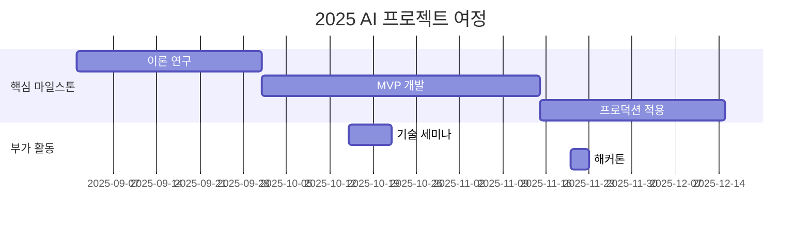

# 10th-template

<h1 align="center"> 10th Template </h1>

<div align="center">
<a href="https://pseudo-lab.com"></a>
<a href="https://discord.gg/EPurkHVtp2"></a>
<a href="https://github.com/Pseudo-Lab/10th-template/stargazers"></a>
<a href="https://github.com/Pseudo-Lab/10th-template/network/members"></a>
<a href="https://github.com/Pseudo-Lab/10th-template/pulls"></a>
<a href="https://github.com/Pseudo-Lab/10th-template/issues"></a>
<a href="https://github.com/Pseudo-Lab/10th-template/graphs/contributors"></a>
<a href="https://hits.seeyoufarm.com"></a>
</div>
<br>

<!-- sheilds: https://shields.io/ -->
<!-- hits badge: https://hits.seeyoufarm.com/ -->

> Welcome to OOO repository! We aim to OOO, offering tools and frameworks for OOO, OOO, and OOO. Join us in advancing the field of OOO through open collaboration and innovation!

## 🌟 프로젝트 목표 (Project Vision)
_"이론에서 실전까지, 함께 성장하는 AI 실험실"_  
- Graph-based RAG 스터디 및 프로젝트
- 개인 성장과 집단 지혜의 시너지 창출
- 오픈소스 정신을 바탕으로 한 지식 공유 문화
- 실패를 성공의 디딤돌로 만드는 실험적 접근


## 🧑 역동적인 팀 소개 (Dynamic Team)

| 역할          | 이름 |  기술 스택 배지                                                                 | 주요 관심 분야                          |
|---------------|------|-----------------------------------------------------------------------|----------------------------------------|
| **Project Manager** | 김찬란 |   | 생성형 AI/추천 시스템 최적화             |
| **Member** | 레오나르도 다빈치 |   | 데이터 파이프라인 설계                  |


## 🚀 프로젝트 로드맵 (Project Roadmap)



## 🛠️ 우리의 개발 문화 (Our Development Culture)
**우리의 개발 문화**  
```python
class CollaborationFramework:
    def __init__(self):
        self.tools = {
            'communication': 'Discord',
            'version_control': 'GitHub Projects',
            'ci/cd': 'GitHub Actions',
            'docs': 'Github Wiki'
        }
    
    def workflow(self):
        return """주간 사이클:
        1️⃣ 월요일: 스프린트 플래닝 (Notion 타임라인 공유)
        2️⃣ 수요일: 코드 리뷰 세션 (Live Share)
        3️⃣ 금요일: 데모데이 (실제 적용 사례 발표)"""
```


## 📈 성과 지표 (Achievement Metrics)
**2024 주요 KPI**  
| 지표                     | 목표치 | 현재 달성률 |
|--------------------------|--------|-------------|
| 커밋 수                  | 1,200  | 83%         |
| 이슈 해결률              | 95%    | 89%         | 
| 기술 블로그 게시물       | 24편   | 15편        |
| 오픈소스 기여도          | 8회    | 5회         |


## 💻 주차별 활동 (Activity History)

| 날짜 | 내용 | 발표자 | 
| -------- | -------- | ---- |
| 2025/02/ | OT       |      |
| 2025/02/ |  Part 1. | 미정 | 
| 2025/02/ |  Part 2. | 미정 | 
| 2025/02/ |  Part 3. | 미정 | 
| 2025/03/ |  Part 4. | 미정 | 
| 2025/03/ |  Part 5. | 미정 | 


## 💡 학습 자원 (Learning Resources)
**우리가 만든 지식 허브**  
- [AI Playbook](https://github.com/your-org/ai-playbook): 150+ 페이지의 실전 가이드
- [MLOps Pipeline Template](https://github.com/your-org/mlops-template): 재사용 가능한 인프라 코드
- [Failure Journal](https://your-org.github.io/failure-journal): 50+개의 실패 사례 분석 [31][34]


## 🌱 참여 안내 (How to Engage)
**팀원으로 참여하시려면 러너 모집 기간에 신청해주세요.**  
- 링크 (준비중)

**누구나 청강을 통해 모임을 참여하실 수 있습니다.**  
1. 특별한 신청 없이 정기 모임 시간에 맞추어 디스코드 #Room-GH 채널로 입장
2. Magical Week 중 행사에 참가
3. Pseudo Lab 행사에서 만나기

## Acknowledgement 🙏

OOO is developed as part of Pseudo-Lab's Open Research Initiative. Special thanks to our contributors and the open source community for their valuable insights and contributions.

## About Pseudo Lab 👋🏼</h2>

[Pseudo-Lab](https://pseudo-lab.com/) is a non-profit organization focused on advancing machine learning and AI technologies. Our core values of Sharing, Motivation, and Collaborative Joy drive us to create impactful open-source projects. With over 5k+ researchers, we are committed to advancing machine learning and AI technologies.

<h2>Contributors 😃</h2>
<a href="https://github.com/Pseudo-Lab/10th-template/graphs/contributors">
  
</a>
<br><br>

<h2>License 🗞</h2>

This project is licensed under the [MIT License](https://opensource.org/licenses/MIT).
